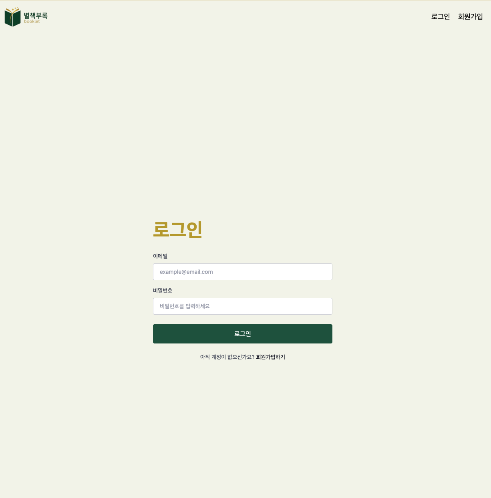
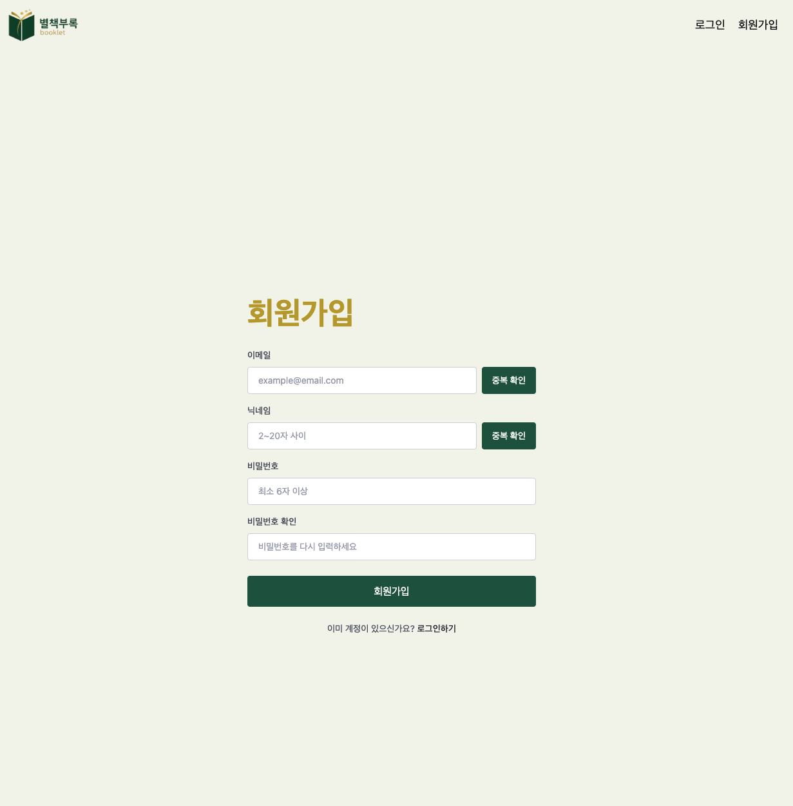
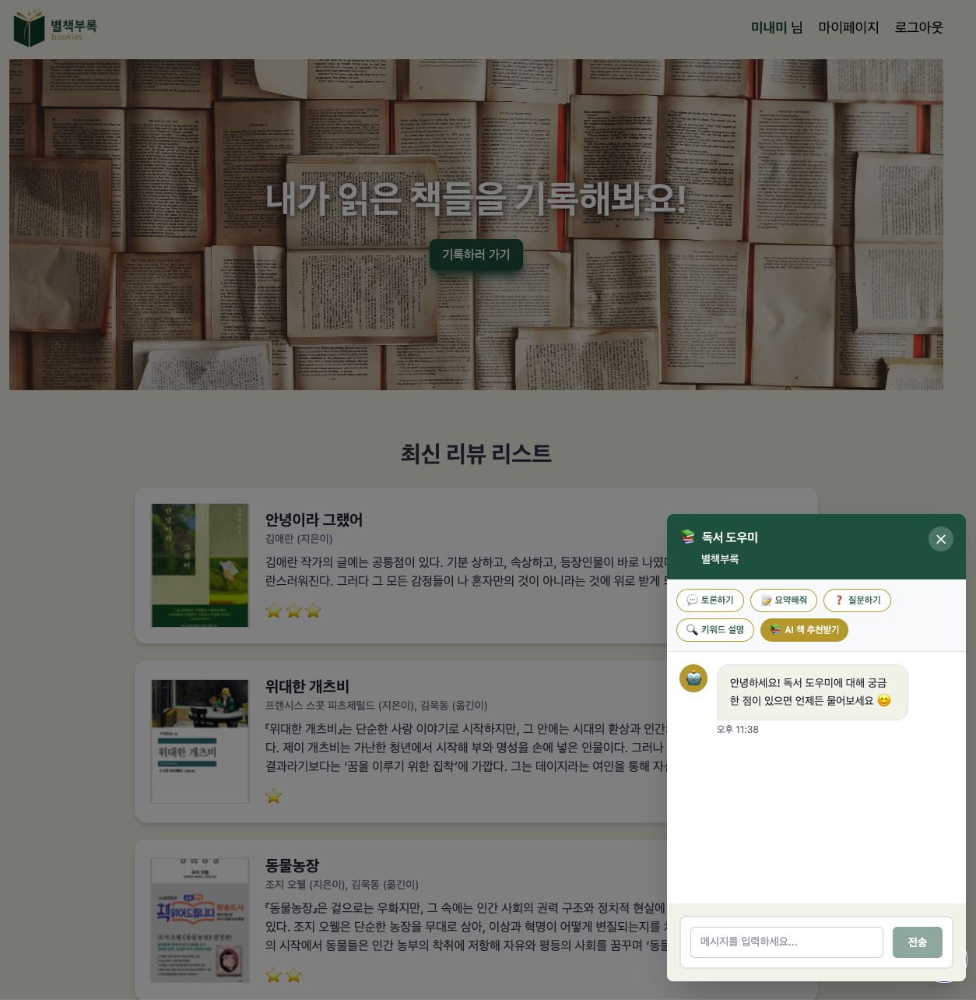
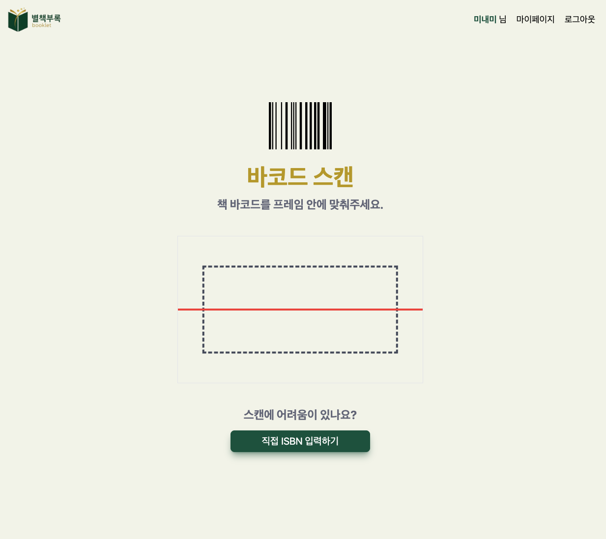
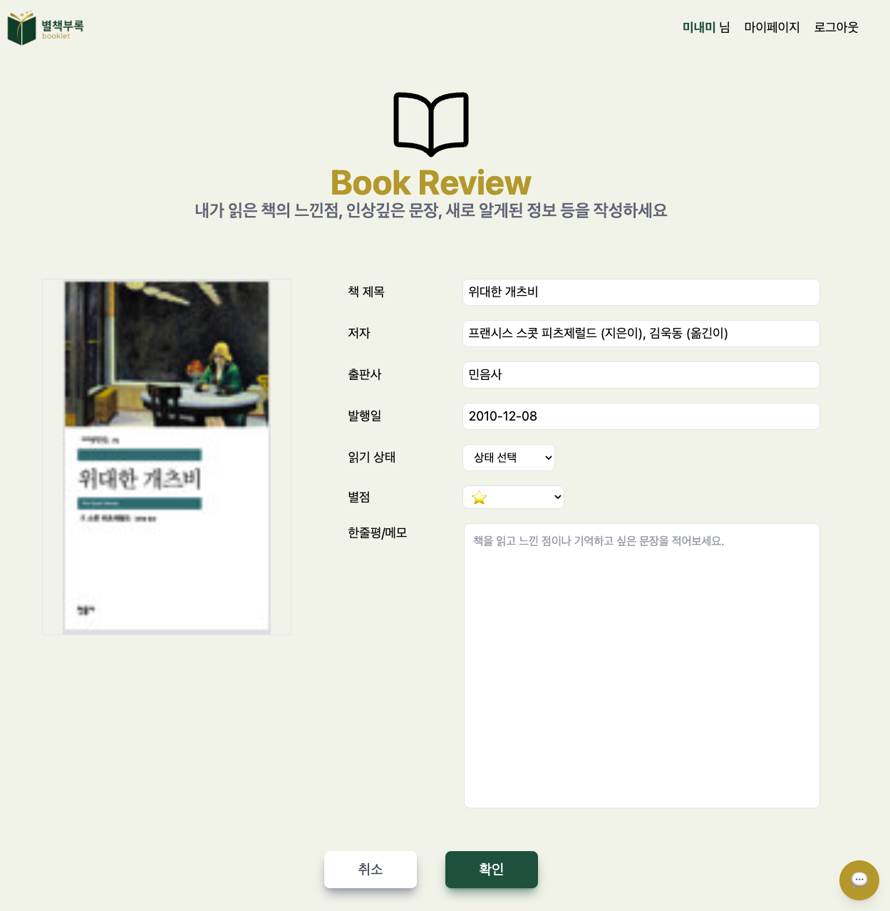
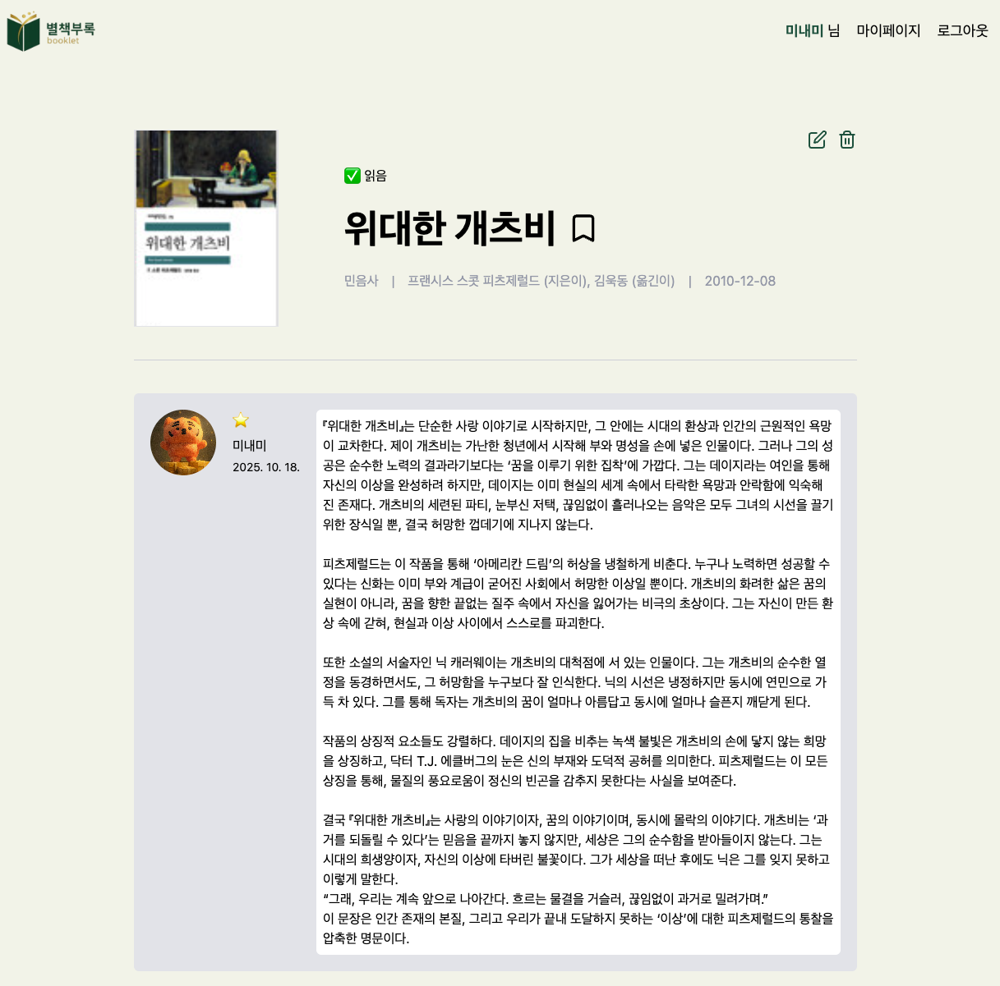
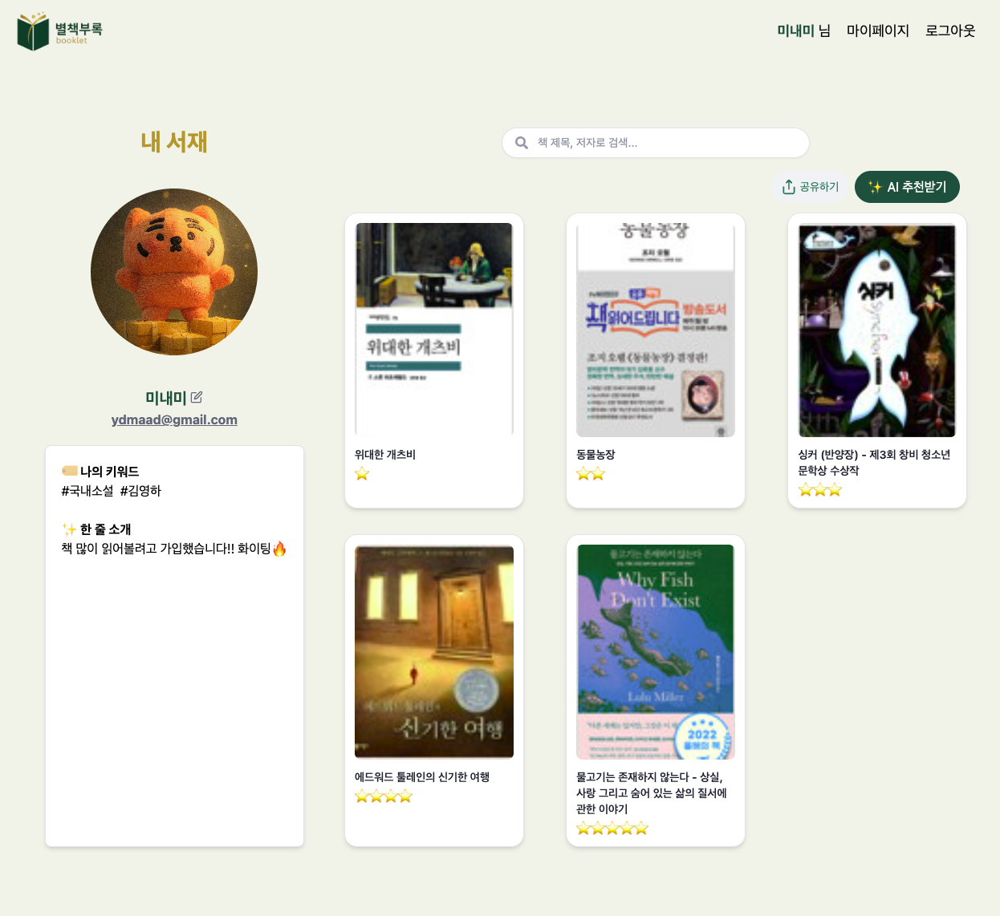
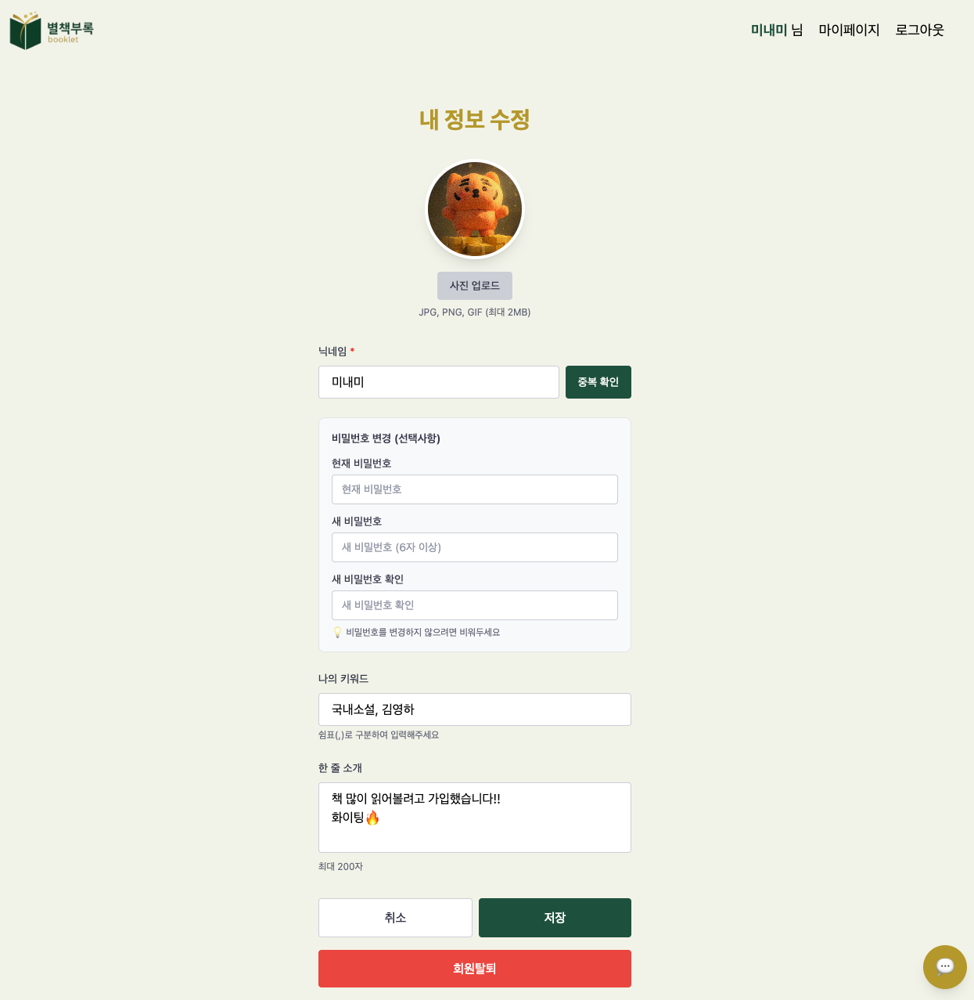
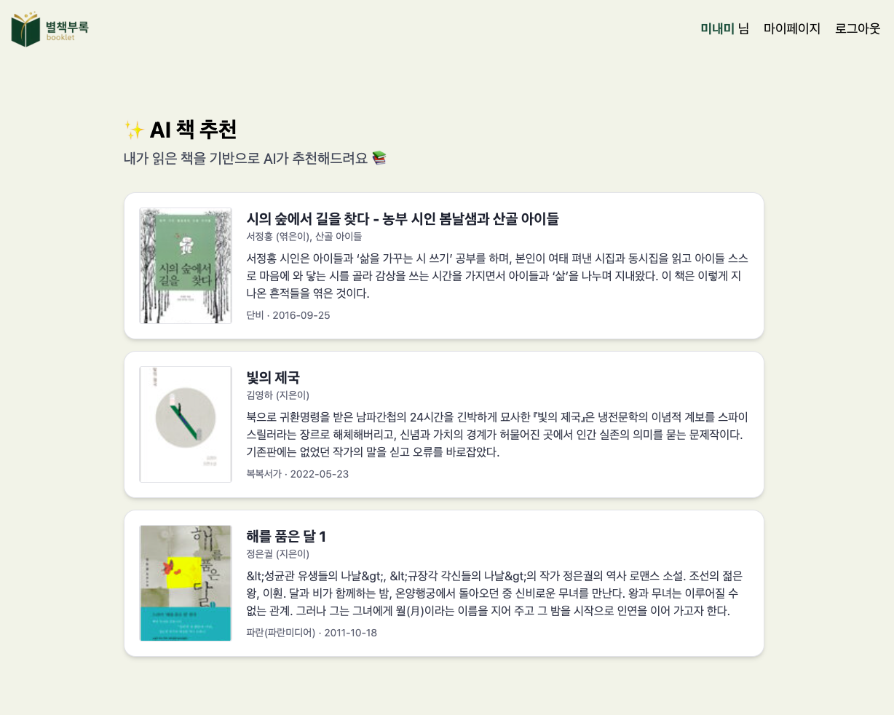

# 🍊 별책부록 (Booklet) / 제주팀

> 나의 독서 여정을 기록하고, AI와 함께 확장하는 독서 커뮤니티
>
> **ISBN 바코드로 시작하는 나만의 AI 독서 기록 웹앱**

---

## 👥 Member

|                                                    🐶 양민애                                                    |                                                      😸 문소정                                                      |                                                              🐰 류향숙                                                              |
| :-------------------------------------------------------------------------------------------------------------: | :-----------------------------------------------------------------------------------------------------------------: | :---------------------------------------------------------------------------------------------------------------------------------: |
| [](https://github.com/ydmaad) | [](https://github.com/thwjd639) | [](https://github.com/shootingstarhaha) |
|                  |           |                                                                     |

<br>


## 📖 프로젝트 소개 (Overview)

**별책부록(Booklet)**은 독서 기록을 쉽게 쌓고,

AI를 통해 더 깊이 있는 독서 경험을 제공하는 웹 애플리케이션입니다.

📷 **ISBN 바코드 스캔**으로 책 정보를 자동 인식하고,

📚 **알라딘 Open API**를 통해 도서 데이터를 불러옵니다.

사용자는 평점, 읽기 상태(읽는 중 / 완독 / 중단), 한 줄 메모를 남기며

**나만의 독서 기록 아카이브**를 만들 수 있습니다.

또한, **AI 챗봇**이 나의 독서 데이터를 기반으로

📖 추천 도서를 제안하고, 💬 독서 토론 주제를 던지며, ❓ 질문에 답해줍니다.

궁극적으로는 다른 사람들과 기록을 공유하는 **독서 커뮤니티**로 확장될 예정입니다.

---

## 🧰 기술 스택 (Tech Stack)

### Frontend

- **React, TypeScript** - 컴포넌트 기반 UI 구현 및 타입 안정성 확보
- **Redux Toolkit** - 전역 상태 관리
- **Tailwind CSS** - 스타일링 및 UI 구성
- **react-zxing** - 실시간 바코드 스캔 기능 구현

### Backend

- **Node.js + Express.js** - RESTful API 서버 구축
- **Supabase** - 사용자 인증(Auth) 및 데이터베이스 관리
- **알라딘 API** - 책 정보 연동

### AI

- **OpenAI API** - 독서 기록 기반 책 추천 및 챗봇 기능

### Deployment

- **AWS EC2** - 서버 배포 및 운영 환경 구성

### Collaboration & Design

- **Figma** - 와이어프레임 및 UI/UX 디자인
- **Notion, Discord, Zep** - 일정 관리 및 팀 커뮤니케이션

---

## ✨ 주요 기능 (Features)

| 구분                  | 기능 설명                                                |
| --------------------- | -------------------------------------------------------- |
| 📷 바코드 스캔        | 카메라로 ISBN 바코드 인식 후 자동으로 도서 정보 가져오기 |
| 📚 도서 정보 자동입력 | 알라딘 API로 제목, 저자, 출판사, 표지 불러오기           |
| ⭐ 독서 기록 관리     | 평점, 읽기 상태(읽는 중/완독/중단), 한줄 메모 저장       |
| 🗂️ 마이페이지         | 나의 독서 기록 목록 및 상태별 필터링                     |
| 🤖 AI 추천            | 읽은 도서 기반으로 유사 도서 및 관심사 기반 추천         |
| 💬 AI 챗봇       | 책 토론, 질문 응답, 사이트 가이드 (컨텍스트 기반 자동 전환)      |
| ❓ AI 질문 응답       | 책 내용·주제·작가 관련 자유 질의응답                     |
| 🧩 커뮤니티 (예정)    | 사용자 간 독서 기록 공유, 댓글, 추천 기능                |

---

## ⚙️ 실행 방법 (Installation & Usage)

### 1️⃣ 프로젝트 클론

```bash
git clone <https://github.com/ydmaad/booklet>
cd booklet
```

### 2️⃣ 패키지 설치

```bash
npm install
```

### 3️⃣ 개발 서버 실행

```bash
npm run dev
```

👉 브라우저에서 `http://localhost:5173` 접속

---

## 📁 폴더 구조 (Directory Structure)

```
📦booklet
 ┣ 📂backend
 ┃ ┣ 📂src
 ┃ ┃ ┣ 📂types
 ┃ ┃ ┃ ┗ 📜chat.types.ts
 ┃ ┃ ┣ 📂routes
 ┃ ┃ ┃ ┗ 📜chat.ts
 ┃ ┃ ┣ 📂services
 ┃ ┃ ┃ ┣ 📜.DS_Store
 ┃ ┃ ┃ ┗ 📜chatService.ts
 ┃ ┃ ┗ 📜app.ts
 ┃ ┣ 📜.env
 ┃ ┣ 📜.gitignore
 ┃ ┣ 📜package-lock.json
 ┃ ┣ 📜package.json
 ┃ ┗ 📜tsconfig.json
 ┣ 📂frontend
 ┃ ┣ 📂public
 ┃ ┃ ┣ 📂favicon
 ┃ ┃ ┃ ┣ 📜apple-touch-icon.png
 ┃ ┃ ┃ ┣ 📜favicon-96x96.png
 ┃ ┃ ┃ ┣ 📜favicon.ico
 ┃ ┃ ┃ ┣ 📜favicon.svg
 ┃ ┃ ┃ ┣ 📜site.webmanifest
 ┃ ┃ ┃ ┣ 📜web-app-manifest-192x192.png
 ┃ ┃ ┃ ┗ 📜web-app-manifest-512x512.png
 ┃ ┃ ┣ 📜default_image.jpg
 ┃ ┃ ┣ 📜main-hero_6.jpg
 ┃ ┃ ┣ 📜main_hero_1.jpg
 ┃ ┃ ┣ 📜main_hero_2.jpg
 ┃ ┃ ┣ 📜main_hero_3.jpg
 ┃ ┃ ┣ 📜main_hero_4.jpg
 ┃ ┃ ┣ 📜main_hero_5.jpg
 ┃ ┃ ┗ 📜title.png
 ┃ ┣ 📂src
 ┃ ┃ ┣ 📂components
 ┃ ┃ ┃ ┣ 📂chat
 ┃ ┃ ┃ ┃ ┣ 📜BookInfoHeader.tsx
 ┃ ┃ ┃ ┃ ┣ 📜ChatBot.tsx
 ┃ ┃ ┃ ┃ ┣ 📜ChatBotModal.tsx
 ┃ ┃ ┃ ┃ ┣ 📜ChatInput.tsx
 ┃ ┃ ┃ ┃ ┣ 📜FloatingChatButton.tsx
 ┃ ┃ ┃ ┃ ┣ 📜LoadingIndicator.tsx
 ┃ ┃ ┃ ┃ ┣ 📜MessageBubble.tsx
 ┃ ┃ ┃ ┃ ┗ 📜QuickActions.tsx
 ┃ ┃ ┃ ┣ 📜BestsellerList.tsx
 ┃ ┃ ┃ ┣ 📜BookItem.tsx
 ┃ ┃ ┃ ┣ 📜EditProfile.tsx
 ┃ ┃ ┃ ┣ 📜Footer.tsx
 ┃ ┃ ┃ ┣ 📜Header.tsx
 ┃ ┃ ┃ ┣ 📜InputField.tsx
 ┃ ┃ ┃ ┣ 📜MyReviewCard.tsx
 ┃ ┃ ┃ ┣ 📜ReviewDetail.tsx
 ┃ ┃ ┃ ┣ 📜ReviewEdit.tsx
 ┃ ┃ ┃ ┣ 📜ReviewItem.tsx
 ┃ ┃ ┃ ┗ 📜ReviewList.tsx
 ┃ ┃ ┣ 📂config
 ┃ ┃ ┃ ┗ 📜api.ts
 ┃ ┃ ┣ 📂lib
 ┃ ┃ ┃ ┣ 📜chatApi.ts
 ┃ ┃ ┃ ┗ 📜supabaseClient.ts
 ┃ ┃ ┣ 📂pages
 ┃ ┃ ┃ ┣ 📜BarcodeScanPage.tsx
 ┃ ┃ ┃ ┣ 📜IsbnInputPage.tsx
 ┃ ┃ ┃ ┣ 📜LoginPage.tsx
 ┃ ┃ ┃ ┣ 📜MainPage.tsx
 ┃ ┃ ┃ ┣ 📜MyPage.tsx
 ┃ ┃ ┃ ┣ 📜RecommendPage.tsx
 ┃ ┃ ┃ ┣ 📜RegisterPage.tsx
 ┃ ┃ ┃ ┗ 📜ReviewCreatePage.tsx
 ┃ ┃ ┣ 📂store
 ┃ ┃ ┃ ┣ 📂slices
 ┃ ┃ ┃ ┃ ┣ 📜authSlice.ts
 ┃ ┃ ┃ ┃ ┣ 📜booksSlice.ts
 ┃ ┃ ┃ ┃ ┗ 📜reviewsSlice.ts
 ┃ ┃ ┃ ┣ 📜hooks.ts
 ┃ ┃ ┃ ┗ 📜store.ts
 ┃ ┃ ┣ 📂types
 ┃ ┃ ┃ ┣ 📜book.types.ts
 ┃ ┃ ┃ ┣ 📜chat.types.ts
 ┃ ┃ ┃ ┗ 📜user.types.ts
 ┃ ┃ ┣ 📂utils
 ┃ ┃ ┣ 📜App.css
 ┃ ┃ ┣ 📜App.tsx
 ┃ ┃ ┣ 📜index.css
 ┃ ┃ ┣ 📜main.tsx
 ┃ ┃ ┗ 📜vite-env.d.ts
 ┃ ┣ 📜.env
 ┃ ┣ 📜.env.production
 ┃ ┣ 📜.gitignore
 ┃ ┣ 📜eslint.config.js
 ┃ ┣ 📜index.html
 ┃ ┣ 📜package-lock.json
 ┃ ┣ 📜package.json
 ┃ ┣ 📜postcss.config.js
 ┃ ┣ 📜tailwind.config.js
 ┃ ┣ 📜tsconfig.app.json
 ┃ ┣ 📜tsconfig.json
 ┃ ┣ 📜tsconfig.node.json
 ┃ ┗ 📜vite.config.ts
 ┗ 📜README.md

```

---

## 🖼️ 미리보기 (Preview)

<div>



</div>
<div>



</div>
<div>



</div>
<div>

</div>

<br>
<br>

🔗 [배포 링크](http://13.125.224.194)

---

## 🚀 향후 개선 계획 (Future Improvements)

- 🔍 **검색 기능**: ISBN 외 제목/작가명 검색 추가
- 🧠 **AI 개선**: 독서 패턴 분석 및 맞춤형 추천
- 🗣️ **커뮤니티 기능**: 기록 공유, 댓글, 토론방
- 📈 **통계 기능**: 읽은 책 수, 평균 평점, 독서 시간 시각화
- 📱 **반응형 UI 및 PWA 지원**

### 게이미피케이션
- 🏆 **뱃지/성취 시스템**: 독서 마일스톤별 뱃지 획득
- ⭐ **레벨 & 경험치**: 독서 활동으로 레벨업
- 🎯 **독서 챌린지**: 30일 연속 독서, 장르 마스터 등
- 👥 **키워드 매칭**: 비슷한 취향의 독자 연결

### AI 챗봇
- 💾 **대화 히스토리 저장**: Supabase에 책별 대화 내역 저장
- 📚 **내서재 연동**: 내서재에서 선택한 책으로 대화
- 🎤 **음성 입력/출력**: 음성으로 질문하고 답변 듣기
- 📊 **독서 통계 연동**: "이번 달 읽은 책 요약해줘" 같은 질문

---

## 📄 라이선스 (License)

이 프로젝트는 개인 학습 및 포트폴리오 용도로 제작되었습니다.

필요 시 MIT License로 전환 가능합니다.
